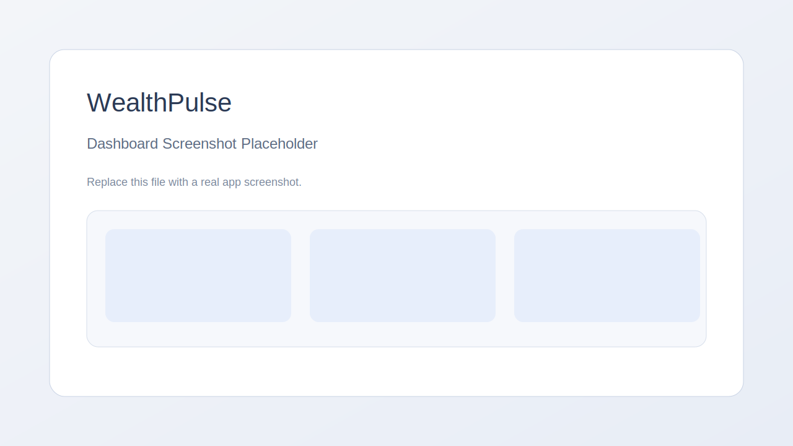
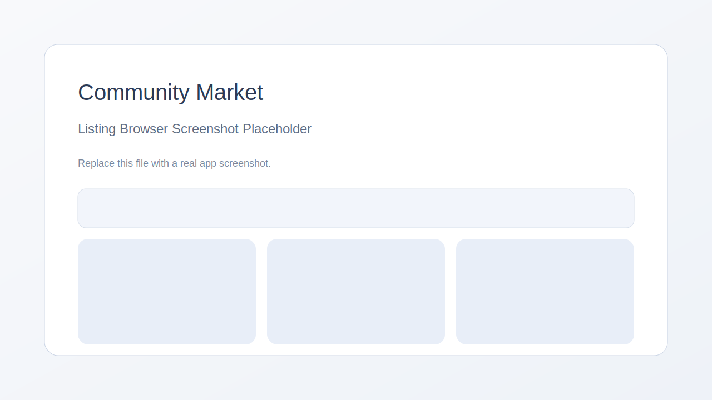

# WealthPulse

WealthPulse is a Streamlit app for tracking assets, liabilities, and wealth plans with optional community listings and live market data.

## Highlights
- Portfolio dashboard with entity views and privacy mode
- Asset tracking with photos, notes, and type-specific details
- Bullion summary with live metals pricing
- Community marketplace with listings, watchlist, auctions, and messaging
- Analytics, charts, and buy/sell signals

## Screenshots



Replace the placeholder images in `docs/` with real screenshots before launch.

## Local Run
```bash
python3 -m venv .venv
source .venv/bin/activate
pip install -r requirements.txt
streamlit run wealth_tracker.py
```

## Configuration
Use Streamlit secrets for production. Create `.streamlit/secrets.toml` with your keys (do not commit).

Example:
```toml
SUPABASE_URL = ""
SUPABASE_ANON_KEY = ""
SUPABASE_SERVICE_KEY = ""
SUPABASE_USE_SERVICE_ROLE = true
SUPABASE_AUTH_REQUIRED = false
APP_STORAGE_PROVIDER = "Local"
METALPRICE_API_KEY = ""
FREEGOLDPRICE_API_KEY = ""
METALS_DEV_API_KEY = ""
NEWS_API_KEY = ""
EBAY_CLIENT_ID = ""
EBAY_CLIENT_SECRET = ""
REVERB_API_TOKEN = ""
SMTP_HOST = ""
SMTP_PORT = 587
SMTP_USER = ""
SMTP_PASSWORD = ""
SMTP_USE_TLS = true
```

## Supabase Community
- Run the SQL in `supabase_community_schema.sql` to create tables and policies.
- If using open access, uncomment the "Open community access" block in the SQL and run it.
- If using auth, set `SUPABASE_AUTH_REQUIRED = true` and ensure RLS policies require auth.

## Streamlit Community Cloud Deployment
1. Push this repo to GitHub
2. In Streamlit Cloud: New app → select repo/branch → `wealth_tracker.py`
3. Add secrets in Streamlit Cloud settings

## Notes
- `wealth_data.json` and `remember_me.json` are local and ignored by git.
- For production, use HTTPS and store keys in secrets.

## License
See `LICENSE` for terms.

## Support
Email: wealthpulse@outlook.co.nz
